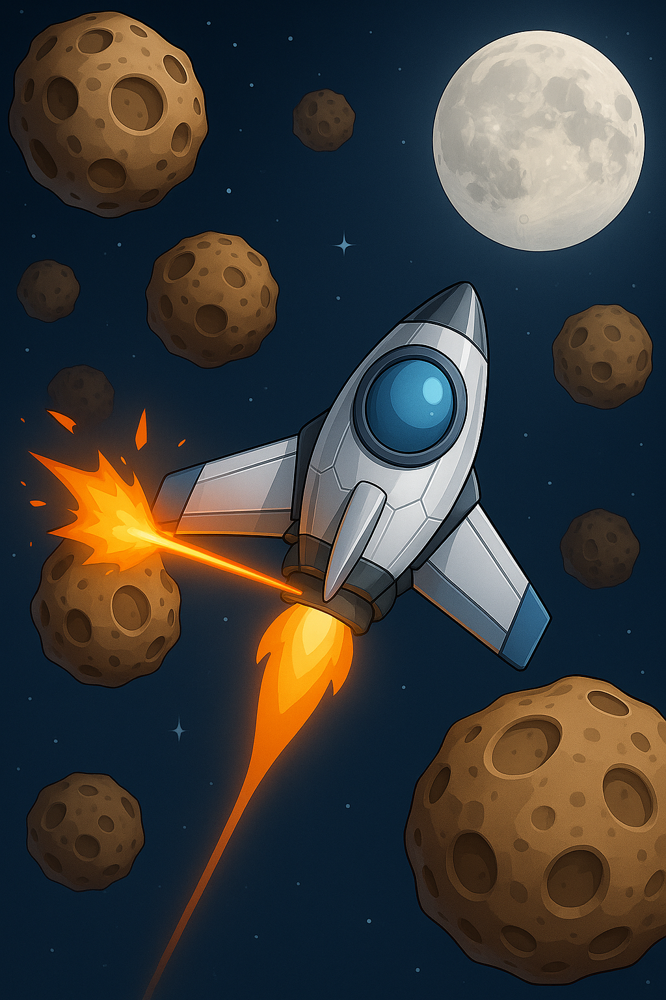

<p align="center">
  
</p>


---

## 📃 Descrição
O **Go To The Moon** é um jogo mobile desenvolvido para Android utilizando Kotlin e uma engine própria baseada em **Canvas**. O jogador controla uma nave espacial e precisa sobreviver a ondas de asteroides, coletar power-ups e resistir por tempo suficiente para vencer.
A arquitetura do projeto é modular, separando responsabilidades como renderização, entidades, telas e gerenciamento de recursos.

---

## 💻 Tecnologias Utilizadas

- **Kotlin**
- **Android SDK (API 33+)**
- **Canvas API**
- **SoundPool & MediaPlayer**
- **Game Engine própria**

---

## 🛎️ Funcionalidades

- 🎮 Game loop em tempo real
- 🚀 Controle da nave via toque
- ☄️ Asteroides dinâmicos (normais e gigantes)
- ⚡ Power-ups:
  - Shield
  - Double Shot
  - Extra Life
- 💥 Sistema de colisões com efeitos visuais
- 🔊 Efeitos sonoros
- 📊 Sistema de pontuação com combo
- ❤️ Sistema de vidas
- ⏱️ Timer de sobrevivência
- 🖥️ Telas:
  - StartScreen
  - SpaceScreen
  - EndScreen

---

## 🧠 Arquitetura

### Core
- `Game`: Loop principal, renderização e escala
- `Render`: Desenho no Canvas e input

### Screens
- `StartScreen`
- `SpaceScreen`
- `EndScreen`

### Managers
- `EntityManager`

### Entidades
- `Ship`
- `Asteroid`
- `Laser`
- `PowerUp`
- `Collision`
- `Star`

### Utils
- `ResourceLoader`
- `SoundManager`
- `Fonts`

---

## ▶️ Como Rodar o Projeto

### Pré-requisitos

- Android Studio atualizado
- JDK 17+
- Emulador ou dispositivo Android (API 33+)

---

### Clone o repositório

- git clone <URL_DO_PROJETO>
  
### Execute

- Execute o comando para sincronizar as dependências: 
  ```bash
  ./gradlew build
- Execute o comando para compilar e instalar o app no dispositivo/emulador: 
  ```bash
  ./gradlew installDebug

Ou rode diretamente pelo Android Studio.

## 🎮 Como Jogar
- Toque na tela para mover a nave
- Segure o botão vermelho para atirar
- Desvie dos asteroides
- Colete power-ups
- Sobreviva por 60 segundos

## ⚙️ Recursos

### Renderização
- Buffer próprio com escala adaptativa
- Anti-aliasing

### Áudio
- SoundPool (efeitos)
- MediaPlayer (música)
- 
### Colisão
- Baseada em distância (raio)
- Sistema de partículas
- 
## 📈 Destaques
- Engine própria (sem Unity/LibGDX)
- Loop e renderização manuais
- Baixo acoplamento
- Controle de memória (recycle de bitmaps)

## 🎥 Apresentação do Projeto

[Apresentação](https://youtube.com/shorts/lktlwBUJVvE)
